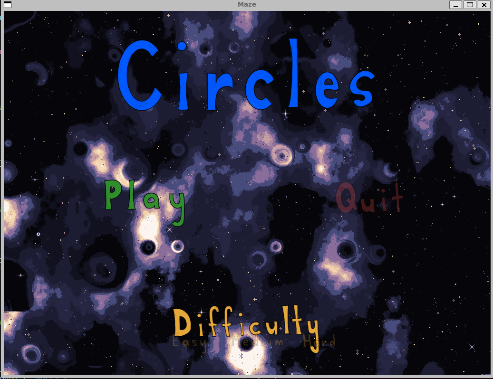
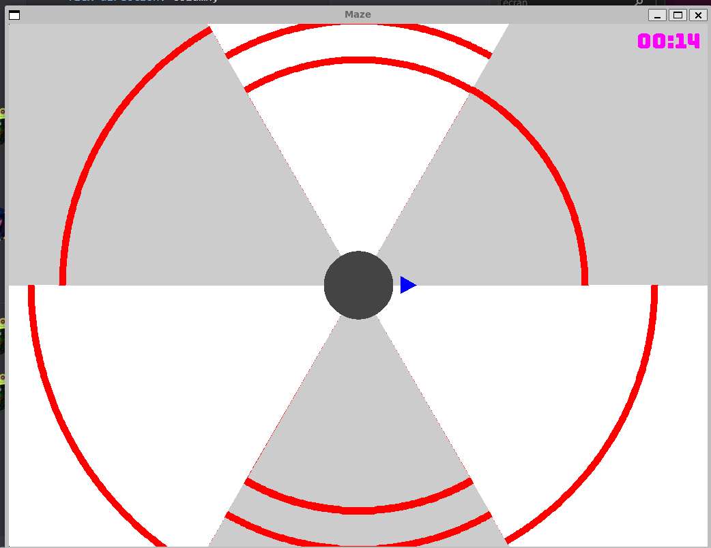

# Travail pratique 3 : Le jeu *Circles*

## Description

Circle est un jeu de type "survie" (survival) où le joueur doit éviter des obstacles en se déplaçant autour d'un disque gris. Le but du jeu est de survivre le plus longtemps possible et de réaliser le meilleur score. Le joueur peut se déplacer en utilisant les touches fléchées du clavier. Le jeu se termine lorsque le joueur touche un obstacle.Une fois le jeu commencé, le joueur ne peut pas quitter le jeu.

Ce jeu a été réalisé dans le cadre du cours INF3135, à l'Université d'UQAM. IL à été réalisé comme projet de groupe métant en pratique les notions apprises en classe tout en cherchant la mise en pratique de la programmation en C d'un manière plus approfondie.

## Auteurs

- Sébastien Kenny Merilan (MERS83040208)
- Jean-Christophe Clouâtre (CLOJ73020201)

## Dépendances

Les dépendances que le programme à besoin impérativement pour même être utilisable sont :

* [Make](https://www.gnu.org/software/make/) Il permet d'automatiser la compilation du code source et de générer des exécutables. Le Makefile de Mot Cache est fourni avec le code source et permet une compilation facile et rapide.
* [GCC](https://gcc.gnu.org/) Il s'agit du compilateur de C/C++ utilisé pour la compilation du code source de Mot Cache. Il est disponible pour la plupart des systèmes d'exploitation et est facilement installable.
* [SDL2](https://www.libsdl.org/) Il s'agit d'une bibliothèque de développement de jeux vidéo. Elle permet de créer des jeux vidéo et des applications multimédias. Elle est utilisée pour la création de la fenêtre du jeu et pour l'affichage des éléments graphiques.

En particuleier, le programme utilise les bibliothèques suivantes de SDL2 :
* `libsdl2-ttf-dev` Une bibliothèque d'extension pour SDL2 qui permet de charger et de rendre du texte à partir de fichiers de police TTF (TrueType Font).
* `libsdl2-mixer-dev` Une bibliothèque d'extension pour SDL2 qui permet de jouer des effets sonores et de la musique en arrière-plan dans divers formats tels que WAV, MP3, OGG, etc.
* `libsdl2-image-dev` Une bibliothèque d'extension pour SDL2 qui permet de charger et de manipuler des images dans différents formats tels que PNG, JPEG, BMP, etc.
* `libsdl2-dev` Une bibliothèque multimédia de base qui fournit des fonctionnalités pour la gestion de fenêtres, la création de rendus graphiques 2D et 3D, la gestion des événements et des entrées utilisateur, et bien plus encore.
* `libsdl2-gfx-dev` Une bibliothèque d'extension pour SDL2 qui fournit des fonctions pour dessiner des primitives géométriques telles que des lignes, des cercles, des rectangles, etc.

## Fonctionnement


En premier lieu, pour pouvoir compiler le jeu, il vous faut installer les dépendances nécessaires. Pour ce faire, il vous suffit d'exécuter la commande suivante dans le terminal de votre système.
```
$ sudo apt-get install libsdl2-ttf-dev libsdl2-mixer-dev libsdl2-image-dev libsdl2-dev libsdl2-gfx-dev
```

Ensuite pour compiler le jeu, il vous suffit de vous rendre d'abord dans le dossier /src, puis d'exécuter simplement la commande `make` dans le terminal de votre système. 
```
$ make
```
Par la suite, une fois le jeu compilé, vous pouvez lancer le jeu en exécutant la commande `./circles`.
```
$ ./circles
```

## Comment jouer

Vous incarnez un triangle bleu et votre objectif est de survivre aussi longtemps que possible en évitant les obstacles qui se déplacent vers le centre de l'écran.

Si votre triangle entre en contact avec l'un des obstacles représentés par des arcs rouges, vous perdez la partie et retournez au menu principal.

Le jeu est conçu pour être un jeu de type "survival" à parcours théoriquement infini, donc votre but est de battre votre propre record de durée de survie.

Pour vous déplacer dans le menu principal, vous pouvez utiliser les touches fléchées du clavier `gauche`, `droite`,  `haut` et `bas`. la touche `Enter` permet de confirmer un choix.  Pour quitter le jeu, vous pouvez appuyer sur l'option `quit` ou cliqué sur le bouton `x ` de l'écran avec la souris dans le menu principal.

Pour vous déplacer en jeu,vous pouvez utiliser les touches fléchées du clavier gauche et droite. Les seuls mouvements que vous pouvez faire sont dans le sens horaire ou anti-horaire autour du cercle gris au centre de l'écran. Il n'est pas possible de quitter le jeu en cours de route.

Une option de playlist est présent dans la phase de jeu en cours, vous pouvez appuyer sur la touche `espace` pour pouvoir changer la musique de fond en cours à partir de la liste de musique disponible.

## Captures d'écran



Le jeu dans sa phase de menu principal.



Le jeu en cours de partie.

## Plateformes supportées

Les différentes plateformes prises en charge par ce jeu ont été soumises à une série de tests minutieux, et il est compatible avec les systèmes d'exploitation Linux et macOS. Il n'est pas compatible avec Windows. Le jeux prend en charge la vesion 2.0 la plus récente de SDL2.

## Division des tâches

Le projet a été divisé en plusieurs tâches, chacune d'entre elles a été attribuée à un membre de l'équipe. Les tâches ont été réparties de manière équitable entre les membres de l'équipe.

* [X] Gestion du menu (sebastien et Jean-Christophe)
* [x] Affichage de la scène (Jean-Christophe)
* [x] Affichage du chronomètre (Jean-Christophe)
* [x] Animation des murs (Jean-Christophe)
* [X] Animation du joueur (Jean-Christophe)
* [x] Détection des collisions (Jean-Christophe)
* [x] Affichage d'une partie terminée (Sébastien)
* [X] Gestion de la musique principale (Sébastien)
* [x] Gestion des sons lorsqu'on navigue dans le menu (Sébastien)
* [x] Gestion de la musique de fin de partie (Sébastien)

## État du projet

Le projet est complété et sans bogue. (sauf si le vous le testez sur Windows, on à pas pris la peine de le faire fonctionner sur cette plateforme)
